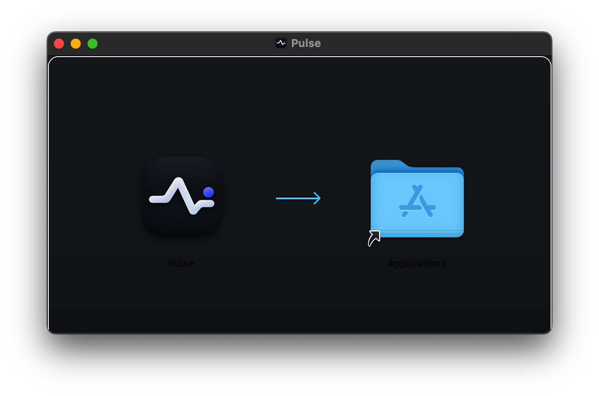

<div align="center">


# Pulse

### Native, peer-to-peer infrastructure observability and remediation for macOS and Linux.

[](https://apple.com)
[](#)
[](https://go.dev)
[](LICENSE)

Pulse connects your Mac directly to your servers over encrypted WebSockets and mutual TLS. No cloud accounts, no third-party telemetry, and no heavy Java or Python dependencies on your host machines.

[Quick Start](#quick-start) • [Installation Methods](#installation-methods) • [Features](#features) • [Diagnostics](#diagnostics) • [Architecture](#architecture) • [FAQ](#frequently-asked-questions)

</div>

---

## Overview

Most infrastructure monitoring tools force a choice between two bad options: expensive SaaS dashboards that send your server data to third parties, or clunky self-hosted setups that consume half a gigabyte of memory just to show CPU percentages.

Pulse takes a different approach:
- **Direct connection**: Your Mac opens an encrypted link directly to your server. No intermediary relay, no SaaS middleman.
- **Low memory footprint**: The Go daemon uses under 15 MB of RSS memory on Linux. It runs comfortably on 512 MB VPS instances.
- **Controlled operations**: Inspect Docker logs, restart crashed processes, or trigger safe remediation rules directly from your menu bar.

---

## Quick Start

### 1. Download Pulse for Mac

Prebuilt styled DMG installers with native Finder drag-and-drop:

- **[Pulse-0.9.0-arm64.dmg](https://github.com/miftahganzz/Pulse/releases/latest/download/Pulse-0.9.0-arm64.dmg)** — Apple Silicon Macs (M1 / M2 / M3 / M4)
- **[Pulse-0.9.0-x86_64.dmg](https://github.com/miftahganzz/Pulse/releases/latest/download/Pulse-0.9.0-x86_64.dmg)** — Intel 64-bit Macs
- **[Pulse-0.9.0-Universal.dmg](https://github.com/miftahganzz/Pulse/releases/latest/download/Pulse-0.9.0-Universal.dmg)** — Universal 2 (runs on all Macs)
- **[Pulse-0.9.0.dmg](https://github.com/miftahganzz/Pulse/releases/latest/download/Pulse-0.9.0.dmg)** — Default Universal installer

Open the `.dmg`, drag **Pulse** to `/Applications`, and open it.

<div align="center" style="margin: 16px 0;">
  
</div>

### 2. Connect Your First Server

Press `⌘N` in Pulse, then pick one of the two pairing flows below.

---

## Installation Methods

### Quick Setup — One Command, Pick Your Method

| Connection Method | One-Command Setup |
|---|---|
| Direct IP / LAN | `curl -fsSL https://raw.githubusercontent.com/miftahganzz/Pulse/main/agent/pulse-agent/scripts/install.sh \| sudo bash` |
| Tailscale (zero open ports) | `curl -fsSL https://raw.githubusercontent.com/miftahganzz/Pulse/main/agent/pulse-agent/scripts/setup-tailscale.sh \| sudo bash` |
| Cloudflare Tunnel (zero open ports) | `curl -fsSL https://raw.githubusercontent.com/miftahganzz/Pulse/main/agent/pulse-agent/scripts/setup-cloudflare.sh \| sudo bash` |

All scripts auto-detect CPU architecture (x86_64 / arm64) and firewall type (UFW, firewalld, iptables). Supported on Debian, Ubuntu, RHEL, CentOS, Fedora, Arch, Alpine, openSUSE, Void Linux, and any systemd-based distro.

---

### Method 1: 1-Line Automated Command

The fastest way to install the daemon on a fresh Linux server:

```bash
curl -fsSL https://raw.githubusercontent.com/miftahganzz/Pulse/main/agent/pulse-agent/scripts/install.sh | sudo bash -s -- --port 8443 --token <YOUR_TOKEN>
```

The script:
1. Detects your CPU architecture (`x86_64` or `arm64`) and pulls the static binary.
2. Creates an unprivileged `pulse` system account.
3. Generates TLS certificates and configures permissions (`chmod 600`).
4. Configures the firewall: UFW, firewalld, or iptables — whichever is active.
5. Starts the background systemd service (`pulse-agent.service`).
6. Prints the server's public IP, auth token, and a ready-to-use `pulse://` deep link.

**Supported distros**: Debian, Ubuntu, RHEL, CentOS, Fedora, Arch Linux, Alpine Linux, openSUSE, Void Linux — and any systemd-based distro.

---

### Method 2: XXX-XXX Pairing Code

If you prefer not to pass tokens over command-line arguments:

1. Install the agent on your server:
   ```bash
   curl -fsSL https://raw.githubusercontent.com/miftahganzz/Pulse/main/agent/pulse-agent/scripts/install.sh | sudo bash
   ```
2. Request a pairing code on your server terminal:
   ```bash
   pulse-agent pair
   ```
   Output:
   ```text
   ┌────────────────────────────────────────────────────────┐
   │  Pulse XXX-XXX Pairing Mode                            │
   │  Pairing Code: 653-557                                 │
   │  Expires in:   10 minutes                              │
   └────────────────────────────────────────────────────────┘
   ```
3. In Pulse on your Mac, select **XXX-XXX Pair Code**, enter your server's public IP and the code `653-557`, then click **Verify & Pair**.

---

## Connecting Over Private Networks (Zero Open Ports)

If you do not want to expose port `8443` to the public internet, Pulse natively supports zero-trust and private mesh setups.

### Option A: Tailscale (Private WireGuard Mesh — Recommended)

Tailscale provides an encrypted, peer-to-peer WireGuard mesh without opening any inbound ports on your server firewall or router.

1. **Install Tailscale on your server**:
   ```bash
   curl -fsSL https://tailscale.com/install.sh | sh
   sudo tailscale up
   ```
2. **Find your server's Tailscale IPv4 address**:
   ```bash
   tailscale ip -4
   # Example: 100.115.82.45
   ```
   *(Alternatively, use the server's MagicDNS name, e.g. `ubuntu-prod.tailnet-xyz.ts.net`).*
3. **Lock down server firewall (Optional but Recommended)**:
   Restrict agent access so only machines on your Tailscale network can reach port `8443`:
   ```bash
   # Allow traffic from Tailscale interface only
   sudo ufw allow in on tailscale0 to any port 8443 proto tcp
   # Block all public incoming traffic to 8443
   sudo ufw deny 8443/tcp
   ```
4. **Connect from your Mac**:
   Ensure your Mac has the Tailscale client running on the same tailnet.
   - In Pulse, click `⌘N` (Add Server).
   - Enter **Host**: `100.115.82.45` (or MagicDNS hostname) and **Port**: `8443`.
   - Paste your agent token and click **Connect Server**.
   - *Pro-tip*: You can also use a **1-click deep link**:
     ```text
     pulse://add?name=My-Tailscale-Node&host=100.115.82.45&port=8443&token=<YOUR_TOKEN>
     ```

---

### Option B: Cloudflare Tunnel (`cloudflared` — Custom Domain via Port 443)

Cloudflare Tunnels create an outbound-only reverse tunnel from your VPS to Cloudflare's global edge network. This allows you to connect Pulse using a custom domain (e.g. `pulse.yourdomain.com`) over standard HTTPS/WSS port `443`, with zero incoming ports open on your firewall. It also works seamlessly behind NAT, CGNAT, or dynamic home IPs.

1. **Install `cloudflared` on your Linux host**:
   ```bash
   # Debian / Ubuntu:
   curl -fsSL https://pkg.cloudflare.com/cloudflare-main.gpg | sudo tee /usr/share/keyrings/cloudflare-main.gpg >/dev/null
   echo 'deb [signed-by=/usr/share/keyrings/cloudflare-main.gpg] https://pkg.cloudflare.com/cloudflared jammy main' | sudo tee /etc/apt/sources.list.d/cloudflared.list
   sudo apt update && sudo apt install -y cloudflared
   ```
2. **Set up the tunnel in Cloudflare Zero Trust**:
   - Go to the **Cloudflare Zero Trust Dashboard** → **Networks** → **Tunnels** → **Create Tunnel**.
   - Select **Cloudflared** and run the provided connector command on your VPS.
   - Under the **Public Hostname** tab, configure:
     - **Subdomain**: `pulse`
     - **Domain**: `yourdomain.com` (your Cloudflare managed domain)
     - **Service Type**: `HTTPS`
     - **URL**: `127.0.0.1:8443`
   - In **Additional application settings** → **TLS**:
     - Enable **"No TLS Verify"** = `ON` (Pulse Agent uses self-signed local TLS; Cloudflare edge terminates valid public SSL to your Mac).
   - Click **Save Hostname**.
3. **Install & Run Pulse Agent**:
   ```bash
   curl -fsSL https://raw.githubusercontent.com/miftahganzz/Pulse/main/agent/pulse-agent/scripts/install.sh | sudo bash -s -- --port 8443 --token <YOUR_TOKEN>
   ```
   *(Note: You do NOT need to open port 8443 in your firewall—cloudflared talks to it locally on `127.0.0.1`)*.
4. **Connect from Pulse on your Mac**:
   - In Pulse, press `⌘N` (Add Server).
   - Enter **Host**: `pulse.yourdomain.com`
   - Enter **Port**: `443`
   - Paste your agent token and click **Connect Server**.
   - *Pro-tip*: Use a **1-click deep link**:
     ```text
     pulse://add?name=Cloudflare-Node&host=pulse.yourdomain.com&port=443&token=<YOUR_TOKEN>
     ```
   - Cloudflare terminates public SSL on port 443 and streams encrypted WebSockets directly into Pulse.

---

### 1-Click Server Onboarding (`pulse://` Deep Linking)

Pulse registers the `pulse://` URL scheme on macOS. You can generate one-click onboarding links for your team or internal documentation:

```text
pulse://add?name=<SERVER_NAME>&host=<HOST_OR_DOMAIN>&port=<PORT>&token=<TOKEN>
```

When clicked in Safari, Slack, or terminal (`open "pulse://..."`), Pulse automatically pops open the Add Server sheet with the host, port, and security token pre-filled.

---

## Features

### Menu Bar and Inspector
- **Live Menu Bar widget**: Shows real-time CPU, RAM, and alert badges without occupying dock space.
- **Process manager**: Sort processes by CPU or memory usage; send `SIGTERM` or `SIGKILL` directly from the UI.
- **Hardware telemetry**: Load averages, disk write spikes, network throughput, and memory pressure breakdown.

### Container and Service Discovery
- **Docker engine integration**: Track container status, inspect memory limits, and stream live stdout/stderr logs.
- **Supported providers**: Built-in modules for Systemd services, PM2 instances, PostgreSQL, Redis, MySQL, MongoDB, Nginx, Caddy, Cloudflare Tunnels, and TCP/HTTP health probes.
- **Automatic discovery**: Discovers active databases and web servers on startup with one-click monitor setup.

### Root-Cause Correlation
- **Dependency graphs**: Map relationships between your infrastructure layers (for example: `Frontend` depends on `API`, which depends on `PostgreSQL`).
- **Cascade suppression**: When a physical host goes down, child alerts for 20 running containers collapse into a single root-cause notification.
- **Flapping mitigation**: Suppresses alert storms when a service rapidly cycles between up and down states.

### Security & Open Ports Inspector
- **Socket & port inventory**: Real-time auditing of listening TCP/UDP sockets with process names, PIDs, and binding addresses.
- **Exposure classification**: Distinguishes between `Public` (`0.0.0.0`), `Private` (`100.x.y.z` Tailscale / RFC 1918), and `Localhost` (`127.0.0.1`).
- **Sensitive port alerts**: Instantly flags exposed databases (Redis, Postgres, MySQL, MongoDB, Docker API) with actionable remediation steps.
- **Firewall inspector**: Reports host firewall status (UFW, iptables, pf) and default incoming policy directly on your dashboard.

### Pro-Grade macOS Experience
- **Native Sparkle 2 Auto-Updates**: Seamless background update checks and one-click in-app upgrades.
- **Launch at Login (`SMAppService`)**: Deep integration with macOS 13+ native ServiceManagement.
- **Custom URL Scheme (`pulse://`)**: Friction-free server onboarding and deep routing from internal documentation.
- **Pixel-perfect Apple HIG design**: Native macOS typography, SF Symbols, multi-level shadows, and responsive split views.

### Remediation Safety Gates
- **Dry-run previews**: Review command side-effects before restarting services.
- **Circuit breaker**: Automatically halts remediation rules if a command fails three consecutive times.
- **Maintenance windows**: Mute alert triggers during scheduled software upgrades.

---

## Diagnostics

To troubleshoot connectivity, port bindings, or systemd status directly on your server:

```bash
pulse-agent doctor
```

Sample output:

```text
┌────────────────────────────────────────────────────────┐
│  Pulse Agent System Doctor (v0.9.0)                    │
└────────────────────────────────────────────────────────┘
 [✔] Pulse Agent Version        : v0.9.0
 [✔] Configuration File         : Found at /etc/pulse/agent.json (Agent ID: pulse_05ae3c)
 [✔] TLS Certificate & Key      : Cert: /etc/pulse/cert.pem, Key: /etc/pulse/key.pem
 [✔] Systemd Service            : pulse-agent.service is active and running
 [✔] Port 8443 Binding          : pulse-agent is actively accepting TCP connections on port 8443
 [✔] HTTPS & Token Auth         : Endpoint responds with TLS and enforces token authentication
 [✔] Firewall (UFW)             : Port 8443 is explicitly allowed in UFW
```

---

## Architecture

```text
┌────────────────────────────────────────────────────────┐
│                    macOS (Pulse.app)                   │
│                                                        │
│  [MenuBar Extra]  [Fleet Dashboard]  [Remediation UI]  │
│  [Keychain Store] [Incident Graph]   [Telemetry Store] │
└───────────────────────────┬────────────────────────────┘
                            │
                            │ HTTPS / TLS (Mutual Identity / Pairing)
                            │ WSS (Encrypted Binary Telemetry Stream)
                            ▼
┌────────────────────────────────────────────────────────┐
│                Linux Host (pulse-agent)                │
│                                                        │
│  [Pairing Manager] [System Collector] [Action Engine]  │
│  [Docker Client]   [Service Probes]   [Provider Reg]   │
└───────────────────────────┬────────────────────────────┘
                            │
                            ▼
         Host Systemd, Containers, Databases, & Logs
```

---

## Frequently Asked Questions

**Is any metric data sent to external cloud servers?**  
No. Pulse uses a direct peer-to-peer model. All metrics stream straight from your Linux host to your Mac.

**How does authentication work?**  
Each server generates a secure authentication token (stored in macOS Keychain). Pairing uses a temporary XXX-XXX code that expires in 10 minutes. Requests require a bearer token header, and tokens are stored in the macOS hardware-backed Keychain.

**Which ports need to be open on my server?**  
Only port `8443/tcp` (or whichever custom port you configure). Both HTTPS requests and WebSocket streams share this single port.

**Can the agent run arbitrary shell scripts?**  
No. The agent does not expose an open shell. Actions are restricted to pre-defined operations (such as `systemctl restart <unit>` or `docker restart <container>`) that pass through explicit safety checks.

**What are the minimum system requirements for the agent?**  
Linux kernel 3.10+, systemd, and at least 32 MB of free RAM. Binary size is roughly 7 MB.

---

## License

Pulse is open-source software licensed under the [MIT License](LICENSE).
